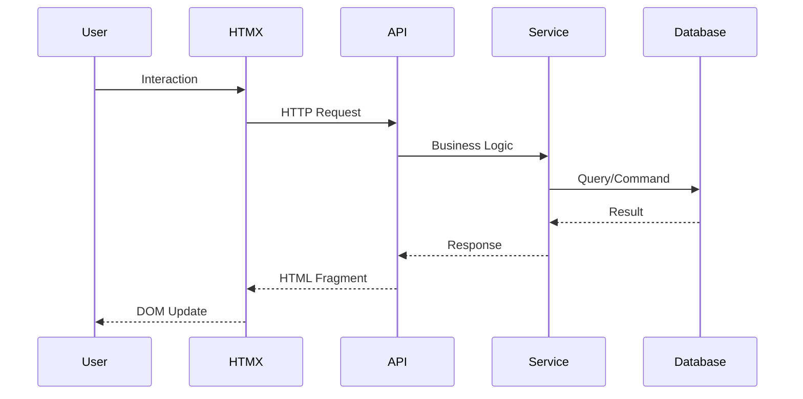
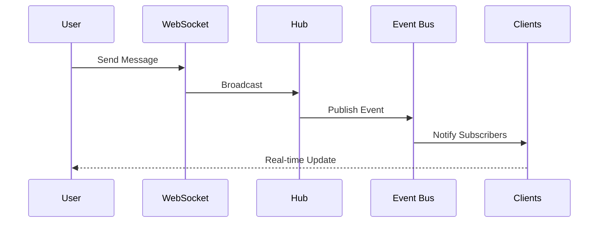
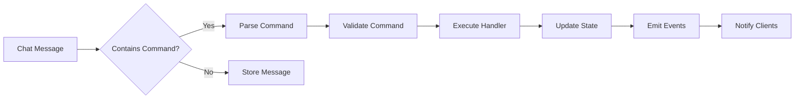

# Архитектура системы

## Общий обзор

Система построена на микросервисной архитектуре с использованием Go для backend и HTMX для frontend. Основные принципы:

- **Event-driven architecture** для слабой связанности компонентов
- **Domain-Driven Design** для организации бизнес-логики
- **CQRS** для разделения команд и запросов
- **Repository pattern** для абстракции доступа к данным

## Компоненты системы

### 1. API Gateway (Echo)

Основной HTTP сервер, обрабатывающий:
- REST API endpoints
- HTMX запросы
- Статические файлы
- WebSocket upgrade

### 2. WebSocket Server

Отдельный сервер для real-time коммуникаций:
- Управление подключениями
- Broadcasting сообщений
- Presence tracking
- Heartbeat/ping-pong

### 3. Worker Service

Background обработка задач:
- SLA мониторинг
- Email уведомления
- Очистка старых данных
- Аналитика и отчеты

### 4. Command Processor

Обработка команд из чата:
- Парсинг команд
- Валидация
- Выполнение действий
- Event generation

## Architecture Layers (Updated 2025-11-11)

```
┌─────────────────────────────────────────────────────────────┐
│                    Interface Layer                          │
│  (Echo HTTP handlers, WebSocket, Middleware)                │
│                  [NOT IMPLEMENTED]                          │
└────────────────────┬────────────────────────────────────────┘
                     │
┌────────────────────┴────────────────────────────────────────┐
│                 Application Layer ✅ 75%                    │
│  ┌──────────────┬──────────────┬───────────────────────┐   │
│  │ Chat         │ Message      │ Task/User/Workspace   │   │
│  │ UseCases     │ UseCases     │ Notification UseCases │   │
│  │ (12 cmd + 3q)│ (8 total)    │ (20 total)            │   │
│  └──────────────┴──────────────┴───────────────────────┘   │
│                                                              │
│  ┌────────────────────────────────────────────────────┐    │
│  │ Tag Processing System ✅                           │    │
│  │ (Integrated with Message UseCases)                 │    │
│  └────────────────────────────────────────────────────┘    │
└────────────────────┬────────────────────────────────────────┘
                     │
┌────────────────────┴────────────────────────────────────────┐
│                   Domain Layer ✅ 90%                       │
│  ┌──────────┬─────────┬──────┬──────────────┬──────────┐   │
│  │ Chat     │ Message │ Task │ Notification │ User     │   │
│  │ Aggregate│ Entity  │ Agg  │ Aggregate    │ Workspace│   │
│  └──────────┴─────────┴──────┴──────────────┴──────────┘   │
│                                                              │
│  30+ Domain Events (ChatCreated, StatusChanged, etc.)       │
└────────────────────┬────────────────────────────────────────┘
                     │
┌────────────────────┴────────────────────────────────────────┐
│              Infrastructure Layer ⏳ 30%                    │
│  ┌────────────────────────────────────────────────────┐    │
│  │ Event Store:  ✅ In-Memory (testing)               │    │
│  │               ⏳ MongoDB (not impl)                │    │
│  └────────────────────────────────────────────────────┘    │
│  ┌────────────────────────────────────────────────────┐    │
│  │ Repositories: ⏳ MongoDB (not impl)                │    │
│  │               ⏳ Redis (not impl)                  │    │
│  └────────────────────────────────────────────────────┘    │
│  ┌────────────────────────────────────────────────────┐    │
│  │ Event Bus:    ⏳ Redis Pub/Sub (not impl)         │    │
│  └────────────────────────────────────────────────────┘    │
└─────────────────────────────────────────────────────────────┘
```

**Legend:** ✅ Implemented | ⏳ In Progress | [NOT IMPLEMENTED] = Planned for Phase 2-3

## Tag Processing System

**Status:** ✅ Implemented and integrated

The Tag Processing System enables chat commands via hashtags in messages. It's fully integrated into the Message domain's SendMessageUseCase.

### How It Works

1. **User sends message** with tag: `"Fix the bug #createTask priority:high"`
2. **SendMessageUseCase** validates and saves message
3. **PublishMessagePostedEvent** triggers tag processing
4. **TagProcessorHandler** listens to event, parses tags (format: `#tagName value:param`)
5. **CommandExecutor** executes the corresponding tag command
6. **Domain events generated** (e.g., TaskCreated, PriorityChanged)

### Supported Tags

| Tag | Command | Description |
|-----|---------|-------------|
| `#createTask` | ConvertToTask | Convert chat to Task |
| `#createBug` | ConvertToBug | Convert chat to Bug with severity |
| `#createEpic` | ConvertToEpic | Convert chat to Epic |
| `#setStatus <status>` | ChangeStatus | Update task status |
| `#assign @user` | AssignUser | Assign task to user |
| `#setPriority <p>` | SetPriority | Set task priority |
| `#setDueDate <date>` | SetDueDate | Set task due date |
| `#setSeverity <s>` | SetSeverity | Set bug severity |

### Integration Points

- **Domain:** `internal/domain/tag/` (parser, executor, validators)
- **Application:** Integrated into `SendMessageUseCase`
- **Event Flow:** `MessagePosted` → `TagProcessorHandler` → Command execution → Domain events

### Example Flow

```
User Message: "Critical login issue #createBug severity:critical #setPriority high"
                    │
                    ▼
         ┌──────────────────────┐
         │   SendMessageUseCase │
         └──────────┬───────────┘
                    │
                    ▼
         ┌──────────────────────┐
         │ Validate & Save Msg  │
         └──────────┬───────────┘
                    │
                    ▼
         ┌──────────────────────┐
         │ Publish MessagePosted│
         │      Event           │
         └──────────┬───────────┘
                    │
                    ▼
         ┌──────────────────────┐
         │ TagProcessorHandler  │
         │  (Event Listener)    │
         └──────────┬───────────┘
                    │
         ┌──────────┴──────────┐
         ▼                     ▼
    ┌────────────┐      ┌──────────────┐
    │Parse Tags  │      │Validate Refs │
    └─────┬──────┘      └──────┬───────┘
          │                    │
          └─────────┬──────────┘
                    ▼
         ┌──────────────────────┐
         │ CommandExecutor      │
         │ - ConvertToBug       │
         │ - SetPriority High   │
         └──────────┬───────────┘
                    │
         ┌──────────┴──────────┐
         ▼                     ▼
    ┌────────────┐      ┌──────────────┐
    │BugCreated  │      │PriorityChanged│
    │  Event     │      │    Event     │
    └────────────┘      └──────────────┘
```

### Code Example

```go
// Tag parser extracts tags from message
tags := parser.Parse("Fix login #createBug severity:critical #setPriority high")
// Result: []Tag{
//   {Name: "createBug", Params: map[string]string{"severity": "critical"}},
//   {Name: "setPriority", Params: map[string]string{"value": "high"}},
// }

// Command executor processes each tag
executor.Execute(ctx, chatID, tags)
// Executes:
// 1. ConvertToBugCommand with severity=critical
// 2. SetPriorityCommand with priority=high
```

## Потоки данных

### 1. Синхронный поток (HTTP Request)



### 2. Асинхронный поток (WebSocket)



### 3. Command Processing



## База данных

### Основные сущности

1. **Users** - пользователи системы
2. **Chats** - чаты (direct, group, support)
3. **Messages** - сообщения в чатах
4. **Tasks** - задачи с state machine
5. **Chat_members** - участники чатов
6. **Audit_log** - аудит действий

### Стратегия хранения

- **PostgreSQL** - основные данные, транзакции
- **Redis** - кеш, сессии, pub/sub
- **MongoDB** (опционально) - архив сообщений
- **S3** (опционально) - файлы и медиа

## Безопасность

### Аутентификация и авторизация

```
┌──────────────┐     ┌──────────────┐     ┌──────────────┐
│   Browser    │────▶│   Keycloak   │────▶│     API      │
└──────────────┘     └──────────────┘     └──────────────┘
        │                    │                     │
        │   1. Login        │                     │
        │──────────────────▶│                     │
        │                    │                     │
        │   2. Auth Code    │                     │
        │◀──────────────────│                     │
        │                    │                     │
        │   3. Exchange Code │                     │
        │──────────────────▶│                     │
        │                    │                     │
        │   4. JWT Token    │                     │
        │◀──────────────────│                     │
        │                    │                     │
        │   5. API Request with JWT               │
        │─────────────────────────────────────────▶│
        │                    │                     │
        │                    │  6. Validate JWT   │
        │                    │◀────────────────────│
        │                    │                     │
        │   7. Response      │                     │
        │◀─────────────────────────────────────────│
```

### RBAC модель

```yaml
roles:
  admin:
    - all_permissions
  manager:
    - manage_team
    - view_reports
    - manage_tasks
  agent:
    - handle_tickets
    - manage_own_tasks
    - chat_access
  user:
    - chat_access
    - create_tasks
    - view_own_data
```

## Масштабирование

### Вертикальное масштабирование

- Увеличение ресурсов сервера
- Оптимизация запросов БД
- Индексирование
- Connection pooling

### Горизонтальное масштабирование

```
                    ┌──────────────┐
                    │ Load Balancer│
                    └──────┬───────┘
                           │
        ┌──────────────────┼──────────────────┐
        │                  │                  │
   ┌────▼────┐       ┌────▼────┐       ┌────▼────┐
   │  API-1  │       │  API-2  │       │  API-3  │
   └────┬────┘       └────┬────┘       └────┬────┘
        │                  │                  │
        └──────────┬───────┴──────────────────┘
                   │
           ┌───────▼──────┐
           │   Redis      │
           │   Pub/Sub    │
           └───────┬──────┘
                   │
        ┌──────────┼──────────┐
        │                     │
   ┌────▼────┐          ┌────▼────┐
   │ Worker-1│          │ Worker-2│
   └─────────┘          └─────────┘
```

## Event-Driven Architecture

### События системы

```go
// Основные события
type Events struct {
    // Chat events
    MessageCreated
    MessageUpdated
    MessageDeleted

    // Task events
    TaskCreated
    TaskAssigned
    TaskStatusChanged
    TaskCompleted

    // User events
    UserJoined
    UserLeft
    UserTyping

    // System events
    SLABreached
    NotificationSent
}
```

### Event Bus

```go
type EventBus interface {
    Publish(ctx context.Context, event Event) error
    Subscribe(eventType string, handler EventHandler) error
    Unsubscribe(subscriptionID string) error
}
```

## Кеширование

### Стратегии кеширования

1. **Cache-aside** - для редко меняющихся данных
2. **Write-through** - для критичных данных
3. **Write-behind** - для массовых операций

### Уровни кеша

```
Application Cache (in-memory)
        ↓
   Redis Cache
        ↓
   Database
```

## Производительность

### Целевые метрики

- **Response Time P50**: < 50ms
- **Response Time P95**: < 200ms
- **Response Time P99**: < 500ms
- **WebSocket Connections**: 10,000+ per instance
- **Messages/sec**: 1,000+
- **Uptime**: 99.9%

### Оптимизации

1. **Database**
   - Connection pooling
   - Prepared statements
   - Proper indexing
   - Query optimization

2. **Caching**
   - Redis для hot data
   - In-memory cache для static data
   - CDN для static assets

3. **Code**
   - Goroutine pools
   - Efficient serialization
   - Minimal allocations
   - Profiling и benchmarking

## Мониторинг и наблюдаемость

### Метрики (Prometheus)

- Business metrics (messages, tasks, SLA)
- System metrics (CPU, memory, disk)
- Application metrics (goroutines, GC)
- Custom metrics

### Логирование (Zerolog)

```go
log.Info().
    Str("user_id", userID).
    Str("action", "message_sent").
    Dur("duration", duration).
    Msg("Message processed successfully")
```

### Трассировка (OpenTelemetry)

- Distributed tracing
- Request correlation
- Performance bottlenecks
- Error tracking

## Disaster Recovery

### Backup стратегия

1. **Database**: Daily snapshots + WAL архивы
2. **Files**: S3 с версионированием
3. **Configuration**: Git repository
4. **Secrets**: Encrypted backups

### RTO/RPO

- **RTO (Recovery Time Objective)**: < 1 час
- **RPO (Recovery Point Objective)**: < 15 минут

## Технологические решения

### Почему Go?

- Высокая производительность
- Отличная поддержка concurrency
- Простота deployment (single binary)
- Сильная типизация
- Богатая экосистема

### Почему HTMX?

- Минимальный JavaScript
- Server-side rendering
- Простота разработки
- Progressive enhancement
- SEO friendly

### Почему PostgreSQL?

- ACID compliance
- JSON support
- Full-text search
- Расширяемость
- Надежность

### Почему Keycloak?

- Enterprise-ready SSO
- Поддержка множества протоколов
- Гибкое управление ролями
- UI для администрирования
- Расширяемость
